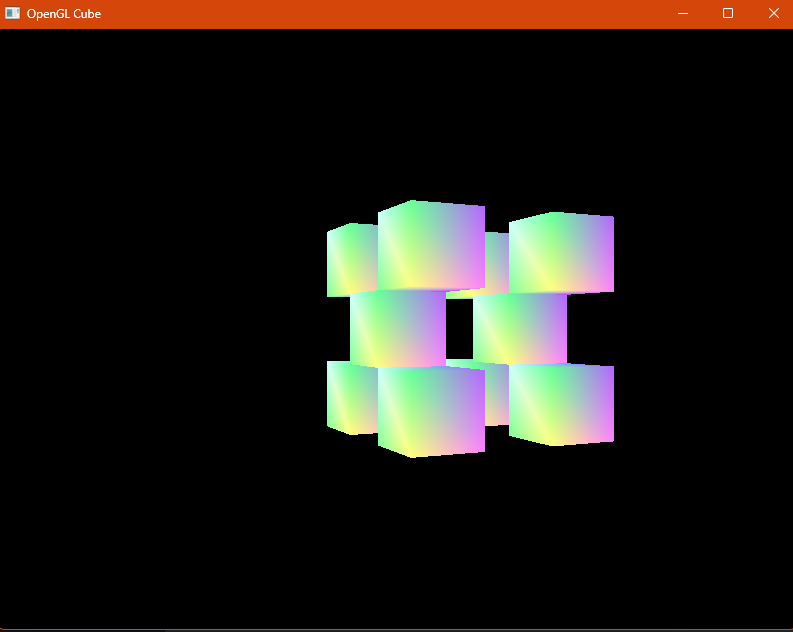
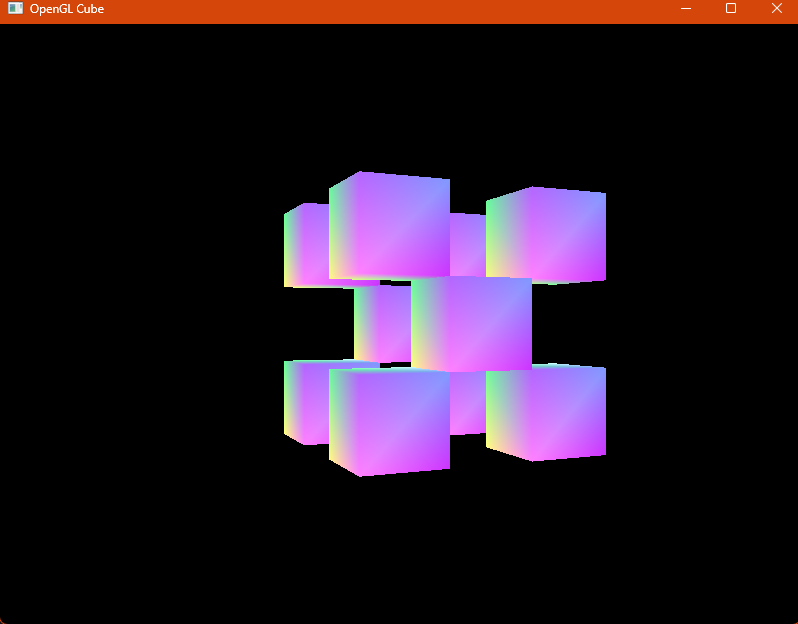

# 3D Object Viewer

An OpenGL project built in C++ to explore 3D rendering, shaders, camera systems and 3D model loading.

## Minimum Requirements

- C++ 17 or higher
- OpenGL 4.1 
- GLFW
- GLAD
- GLM Math Library
- CMake 3.10 or higher
- MSVC or MinGW

## Generate & Build

```bash
   git clone https://github.com/PanicMike-9/3D-Viewer-OpenGL.git
   cd 3D-Viewer-OpenGL
```
```bash
   cmake -S . -B build
   cmake --build build
```
```bash
   ./build/Debug/app.exe
```
## Project Images



